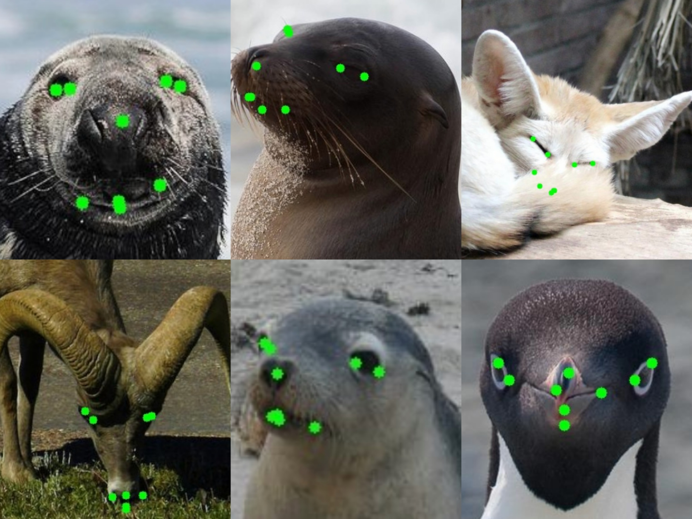

# Meta-CSKT

This project is the implementation of our proposed method **Meta-CSKT**.

## Dataset

AnimalWeb dataset could be downloaded through the link [AnimalWeb](https://drive.google.com/file/d/1Lbg4Bewu92-NxwP7pERKS-2Ny0FX7xqK/view?usp=sharing)

## Demo



## Requirement

pytorch 1.7+

python 3.8

## Test

To test the trained model, you could download our model through the link below.

| Model         | Link                                                         |
| ------------- | ------------------------------------------------------------ |
| 40img trained | [animalweb_40img_best.tar](https://drive.google.com/file/d/1mRzbBPWMtsvjBr5SCYsSFqL3hb4TsH4d/view?usp=sharing) |
| 80img trained | [animalweb_80img_best.pth.tar](https://drive.google.com/file/d/1Qq7YoxDYu2B9HuV-xEjkxHpxRZFDyFbL/view?usp=sharing) |

Download the one you want to test, and put them into checkpoint directory:

```
checkpoint
----animalweb_40img_best.tar
----animalweb_80img_best.pth.tar
test.py
```

To test the result, you could use command below:

```shell
# Test 80 img 

# Known Setting
python test.py --cfg ./experiment/test_80_known.yaml --seed 5 --name test_80_known --dataset animalweb --evaluate --resume checkpoint/animalweb_80img_best.pth.tar

# Unknown Setting
python test.py --cfg ./experiment/test_80_unknown.yaml --seed 5 --name test_80_unknown --dataset animalweb --evaluate --resume checkpoint/animalweb_80img_best.pth.tar

# Test 40 img 

# Known Setting
python test.py --cfg ./experiment/test_40_known.yaml --seed 5 --name test_40_known --dataset animalweb --evaluate --resume checkpoint/animalweb_40img_best.tar

# Unknown Setting
python test.py --cfg ./experiment/test_40_unknown.yaml --seed 5 --name test_40_unknown --dataset animalweb --evaluate --resume checkpoint/animalweb_40img_best.tar

```

For each cfg file, you need to change the dataset directory to your own location:

```yaml
DATASET:
  DATASET: AnimalWeb
  ROOT: 'YOUR_OWN_LOC'
  TRAINSET: './data/train_80img.txt'
  UNLABELSET: './data/all.txt'
  VALSET: './data/all_150.txt'
  TESTSET: './data/all.txt'
  BBOX: './data/bbox.csv'
 ...
```


## Train

| Model            | Link                                                         |
| ---------------- | ------------------------------------------------------------ |
| Human Pretrained | [HR18-AFLW.pth](https://drive.google.com/file/d/13gKD3qz4lxKVOaXbgRJaBrST2QfT9XQG/view?usp=sharing) |
| 80img trained    | [80img_pretrain.pth](https://drive.google.com/file/d/1GPqRJdw5NRUwS4RogCLlfUAtjmyykROM/view?usp=sharing) |

Download the pretrained model and put them like this:

```
pretrained
--HR18-AFLW.pth
pretrained_model
--80img_pretrain.pth
train_ours.py
```

To train this model, use command below:

```shell
# Train 80 img model
python train_ours.py --cfg ./experiment/80.yaml --update-steps 600 --name animalweb_80img --l-threshold 0.050 --f-threshold 0.2 --human_shift human_80.csv --flip_shift flip_80.csv --total-steps 10000  --save-path ./checkpoint --seed 5   --dataset animalweb   --lambda-u 8  --student-wait-steps 0  --resume ./pretrained_model/80img_pretrain.pth

```

## Horse

We also did some experiment on [Horse](https://www.dropbox.com/s/9t770jhcjqo3mmg/release_data.zip) dataset provided by [menorashid](https://github.com/menoRashid/animal_human_kp).

### Train

First, unzip the data and it will look like this:

```
release_data
--aflw
--face
--horse
```

To run the training code, we can use the following command:

First, change the `DATASET.ROOT` in `experiment/horse.yaml` and `experiment/horse_test.yaml` to the path of `release_data`:

```yaml
DATASET:
	ROOT: 'your path'
```

Download [pretrained horse model](https://drive.google.com/file/d/1cAbqJfHY_y_fFZ2qdn3eqaTVadrkPdQu/view?usp=sharing) and put it in `pretrained_model`

```shell
python train_horse.py --cfg ./experiment/horse.yaml  --save-path ./checkpoint_horse --seed 5 --unlabel-root "data root of AnimalWeb" --unlabel-bbox ./data/bbox.csv --name horse  --dataset animalweb   --lambda-u 8  --student-wait-steps 0  --amp --resume ./pretrained_model/horse_pretrain.pth
```

### Test

First, change the `DATASET.ROOT` in `experiment/horse.yaml` and `experiment/horse_test.yaml` to the path of `release_data`:

```yaml
DATASET:
	ROOT: 'your path'
```

Download the trained [mode](https://drive.google.com/file/d/16PQ6K7eovT3gkmD4jY9PHqdfI7xw3YKM/view?usp=sharing), put it in `checkpoint_horse`

```shell
python test.py --cfg ./experiment/horse_test.yaml --seed 5 --name test_horse --dataset animalweb --evaluate --resume checkpoint_horse/horse_best.pth.tar
```

