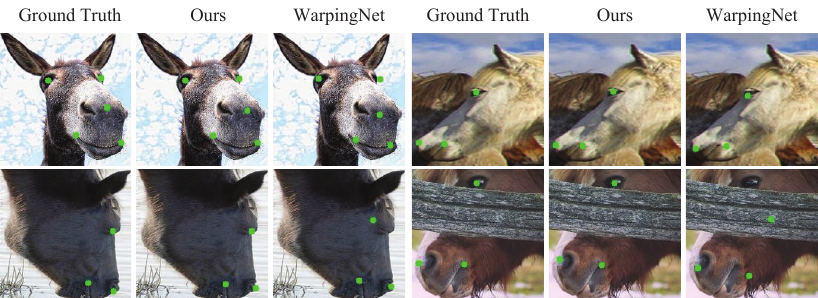

# Meta-CSKT

This project is the implementation of our proposed method **Meta-CSKT**.

## Datasets

### AnimalWeb

AnimalWeb dataset could be downloaded through the link [AnimalWeb](https://drive.google.com/file/d/1Lbg4Bewu92-NxwP7pERKS-2Ny0FX7xqK/view?usp=sharing)

### Horse Dataset

[Horse](https://www.dropbox.com/s/9t770jhcjqo3mmg/release_data.zip) dataset provided by [menorashid](https://github.com/menoRashid/animal_human_kp).
## Demo
**Samples from AnimalWeb**

---


**Samples from Horse Dataset**

---



## Requirement

pytorch 1.7+

python 3.8

## Test

To test the trained model, you could download our model through the link below.

| Model         | Link                                                         |
| ------------- | ------------------------------------------------------------ |
| 40img trained | [animalweb_40img.tar](https://drive.google.com/file/d/1mRzbBPWMtsvjBr5SCYsSFqL3hb4TsH4d/view?usp=sharing) |
| 80img trained | [animalweb_80img.pth.tar](https://drive.google.com/file/d/1Qq7YoxDYu2B9HuV-xEjkxHpxRZFDyFbL/view?usp=sharing) |

Download the one you want to test, and put them into checkpoint directory:

```
checkpoint
----animalweb_40img.tar
----animalweb_80img.pth.tar
test.py
```

To test the result, you could use command below:

```shell
# Test 80 img 

# Known Setting
python test.py --cfg ./experiment/test_80_known.yaml --seed 5 --name test_80_known --dataset animalweb --evaluate --resume checkpoint/animalweb_80img.pth.tar

# Unknown Setting
python test.py --cfg ./experiment/test_80_unknown.yaml --seed 5 --name test_80_unknown --dataset animalweb --evaluate --resume checkpoint/animalweb_80img.pth.tar

# Test 40 img 

# Known Setting
python test.py --cfg ./experiment/test_40_known.yaml --seed 5 --name test_40_known --dataset animalweb --evaluate --resume checkpoint/animalweb_40img.tar

# Unknown Setting
python test.py --cfg ./experiment/test_40_unknown.yaml --seed 5 --name test_40_unknown --dataset animalweb --evaluate --resume checkpoint/animalweb_40img.tar

```

For each cfg file, you need to change the dataset directory to your own location:

```yaml
DATASET:
  DATASET: AnimalWeb
  ROOT: 'YOUR_OWN_LOC'
  TRAINSET: './data/train_80img.txt'
  UNLABELSET: './data/all.txt'
  VALSET: './data/all_150.txt'
  TESTSET: './data/all.txt'
  BBOX: './data/bbox.csv'
 ...
```
## Test Demo Image
To test the single image, we use `test_animalweb_img.ipynb`.
In this jupyter notebook, the to test image name and the model to test need to be specified.
```python
imgname = ['arcticfox_37.jpg',
            'bull_83.jpg',
            'domesticcat_62.jpg',
            'pademelon_106.jpg']
model_name = 'checkpoint/animalweb_80img_best.pth.tar' #change it to the model you want to use
```
You could check the animalweb dataset to choose the image you want to test on your own and just copy the file name.
Once you change the `imgname` and `model_name`, you could just run all.

## Ablation Study Model

[ablation_study_models.zip](https://drive.google.com/file/d/1Y9z6kuha7_LyKddRaQQiB9AKl4P9vBJ-/view?usp=sharing)

## Train

| Model            | Link                                                         |
| ---------------- | ------------------------------------------------------------ |
| Human Pretrained | [HR18-AFLW.pth](https://drive.google.com/file/d/13gKD3qz4lxKVOaXbgRJaBrST2QfT9XQG/view?usp=sharing) |
| 80img trained    | [80img_pretrain.pth](https://drive.google.com/file/d/1GPqRJdw5NRUwS4RogCLlfUAtjmyykROM/view?usp=sharing) |

Download the pretrained model and put them like this:

```
pretrained
--HR18-AFLW.pth
pretrained_model
--80img_pretrain.pth
train_ours.py
```

To train this model, use command below:

```shell
# Train 80 img model
python train_ours.py --cfg ./experiment/80.yaml --update-steps 600 --name animalweb_80img --l-threshold 0.050 --f-threshold 0.2 --human_shift human_80.csv --flip_shift flip_80.csv --total-steps 10000  --save-path ./checkpoint --seed 5   --dataset animalweb   --lambda-u 8  --student-wait-steps 0  --resume ./pretrained_model/80img_pretrain.pth

```

## Horse

We also did some experiment on [Horse](https://www.dropbox.com/s/9t770jhcjqo3mmg/release_data.zip) dataset provided by [menorashid](https://github.com/menoRashid/animal_human_kp).

### Train

First, unzip the data and it will look like this:

```
release_data
--aflw
--face
--horse
```

To run the training code, we can use the following command:

First, change the `DATASET.ROOT` in `experiment/horse.yaml` and `experiment/horse_test.yaml` to the path of `release_data`:

```yaml
DATASET:
	ROOT: 'path of release_data'
```

Download [pretrained horse model](https://drive.google.com/file/d/1cAbqJfHY_y_fFZ2qdn3eqaTVadrkPdQu/view?usp=sharing) and put it in `pretrained_model`

```shell
python train_horse.py --cfg ./experiment/horse.yaml  --save-path ./checkpoint_horse --seed 5 --unlabel-root "data root of AnimalWeb" --unlabel-bbox ./data/bbox.csv --name horse  --dataset animalweb   --lambda-u 8  --student-wait-steps 0  --amp --resume ./pretrained_model/horse_pretrain.pth
```
### Test Demo Images

In `test_horse_img.ipynb`, just run all or you can change the image files.

```python
imgname = [ 'horse/im/flickr-horses/203.jpg', 
            'horse/im/flickr-horses/2756.jpg',
            'horse/im/flickr-horses/6189.jpg', 
            'horse/im/imagenet_n02374451/n02374451_2809.jpg']
            
model_name = 'checkpoint_horse/horse.pth.tar' #change it to the model you want to use
```

### Test

First, change the `DATASET.ROOT` in `experiment/horse.yaml` and `experiment/horse_test.yaml` to the path of `release_data`:

```yaml
DATASET:
	ROOT: 'your path'
```

Download the trained [mode](https://drive.google.com/file/d/16PQ6K7eovT3gkmD4jY9PHqdfI7xw3YKM/view?usp=sharing), put it in `checkpoint_horse`

```shell
python test.py --cfg ./experiment/horse_test.yaml --seed 5 --name test_horse --dataset animalweb --evaluate --resume checkpoint_horse/horse.pth.tar
```

## Japanese Macaque Sub-Dataset

### Test

| Model                        | Link                                                         |
| ---------------------------- | ------------------------------------------------------------ |
| japanesemacaque_best.pth.tar | [japanesemacaque_best.pth.tar](https://drive.google.com/file/d/1vHMoO1emDTwxRpP7QH79o48d8FzH4Mqu/view?usp=sharing) |

```shell
test.py --cfg ./experiment/primate.yaml --seed 5 --name japanese_macaque_test --dataset animalweb --evaluate --resume checkpoint/japanesemacaque_best.pth.tar
```

### Train

Download the pretrained [model](https://drive.google.com/file/d/1P7_6tjkiw-JIa3b0MrCyr58e30VI7JUx/view?usp=drive_link), and put it under pretrained_model/

```shell
train_ours.py --cfg ./experiment/primate.yaml --update-steps 600 --name japanese_macaque --l-threshold 0.0 --f-threshold 0.2 --human_shift japanese_human.csv --flip_shift japanese_flip.csv --total-steps 10000 --save-path ./checkpoint --seed 5 --dataset animalweb --lambda-u 8 --student-wait-steps 0 --resume ./pretrained_model/japanesemacaque.pth
```

## Review

### UDA

| Model             | Link                                                         |
| ----------------- | ------------------------------------------------------------ |
| uda_40img.pth.tar | [uda_40img.pth.tar](https://drive.google.com/file/d/13DeMWoI-bhm7wLITPy3UBQH9YX4vZ3Rk/view?usp=drive_link) |

```shell
# Test 40img known
python test.py --cfg ./experiment/test_40_known.yaml --seed 5 --name test_40_known_uda --dataset animalweb --evaluate --resume checkpoint/uda_40img.pth.tar

# Test 40img Unknown
python test.py --cfg ./experiment/test_40_unknown.yaml --seed 5 --name test_40_unknown_uda --dataset animalweb --evaluate --resume checkpoint/uda_40img.pth.tar
```


### FixMatch

| Model                  | Link                                                         |
| ---------------------- | ------------------------------------------------------------ |
| fixmatch_40img.pth.tar | [fixmatch_40img.pth.tar](https://drive.google.com/file/d/1W1xA7l4KQKtpvWPi4RCn55zY57fdLbbk/view?usp=drive_link) |

```shell
# Test 40img known
python test.py --cfg ./experiment/test_40_known.yaml --seed 5 --name test_40_known_fixmatch --dataset animalweb --evaluate --resume checkpoint/fixmatch_40img.pth.tar

# Test 40img Unknown
python test.py --cfg ./experiment/test_40_unknown.yaml --seed 5 --name test_40_unknown_fixmatch --dataset animalweb --evaluate --resume checkpoint/fixmatch_40img.pth.tar
```

### ScarceNet

Go to the [scarcenet](https://github.com/AnonExploreer/ScarceNet) repo (forked from [ScarceNet](https://github.com/chaneyddtt/ScarceNet))

Download the trained [model](https://drive.google.com/file/d/1qrxMSAQpjBsFtgJVAM-VnrShgqffbSC7/view?usp=drive_link), and move it to ./output/output_part5_updatev2

```
CUDA_VISIBLE_DEVICES=0 python tools/test.py --cfg experiments/ap10k/hrnet/w32_256x192_adam_lr1e-3.yaml --animalpose OUTPUT_DIR test TEST.MODEL_FILE output/output_part5_updatev2/scarcenet.pth MODEL.NAME pose_hrnet_part GPUS [0,]
```
